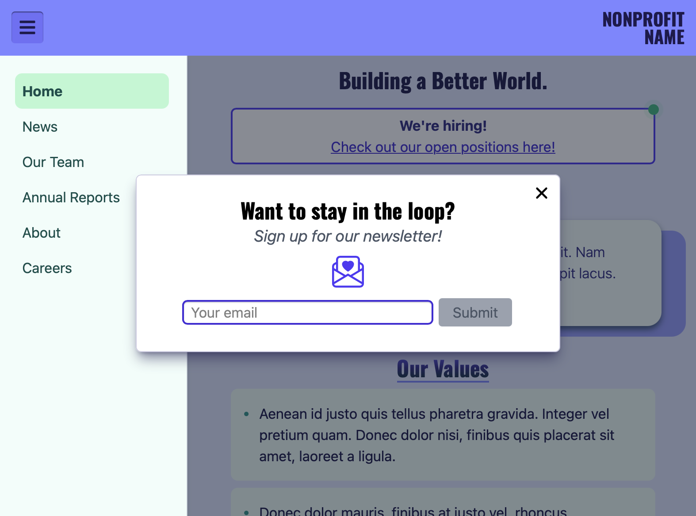
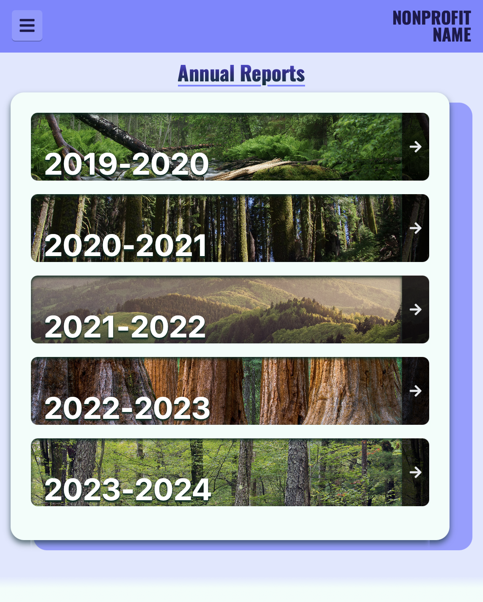
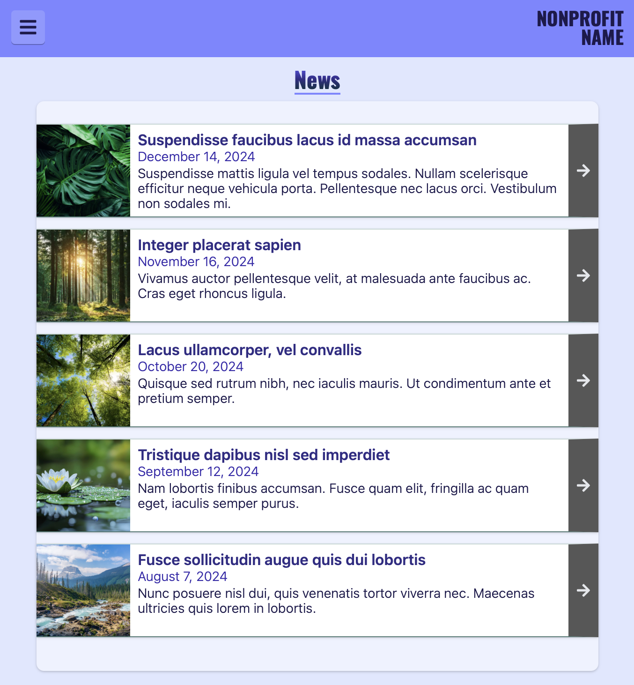

# Nonprofit Template

## Description

Nonprofit Template is a single-page React application that simulates a basic nonprofit website. I built it in order to practice front-end development and learn Tailwind CSS. 

## Technologies

This project was created using TypeScript, React, React-Router, and Tailwind CSS.

## Screenshots

**Modal Dialog**

    
**Annual Reports**
 

        
**News**

## License

This repository uses an [MIT License ↗️](./LICENSE.txt).